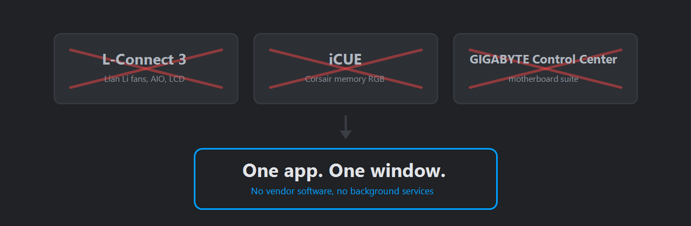
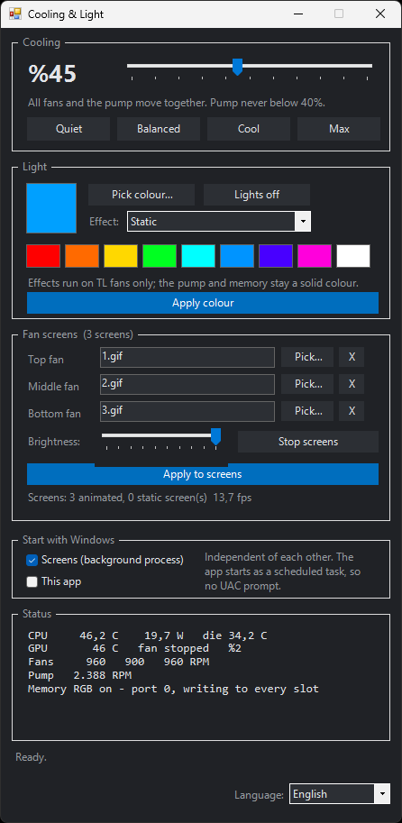

# Lian Li fan, AIO and LCD control for Windows — without vendor software



One small app that controls your Lian Li fans, AIO pump, RGB lighting and TL LCD
screens on Windows. No L-Connect. No iCUE. No GIGABYTE Control Center. No
FanControl. No background services from four different vendors fighting over the
same hardware.



That is the entire application — everything it does is on that one screen.

**Status:** works, used daily, but built around one specific machine. Read
[Supported hardware](#supported-hardware) before you try it — this is not a
universal RGB tool.

---

## Why this exists

A typical build ends up needing a separate resident app per vendor: one for the
fans, one for the AIO, one for the RAM, one for the motherboard. Each one
autostarts, each one runs a background service, and together they cost hundreds
of megabytes of RAM to change a colour twice a year.

This replaces all of them with a single PowerShell app that talks to the hardware
directly — through Windows' built-in HID stack and one signed, sandboxed kernel
driver ([PawnIO](https://pawnio.eu/)).

Linux users already have an excellent answer to this problem
([`sgtaziz/lian-li-linux`](https://github.com/sgtaziz/lian-li-linux)). Windows
users did not. That's the gap this fills.

---

## What it does

| Capability | Hardware | Admin needed |
|---|---|---|
| Fan speed (all fans on one master slider) | Lian Li UNI FAN TL | No |
| Pump speed | Galahad II Trinity AIO | No |
| Fan RGB | UNI FAN TL | No |
| Pump head RGB (inner / outer rings separately) | Galahad II | No |
| AIO fan-channel RGB | Galahad II | No |
| RAM RGB | Corsair Vengeance DDR5 | **Yes** |
| LCD screens — static images and animated GIFs, per fan | UNI FAN TL LCD | No |
| Read CPU temperature and package power | AMD Ryzen | **Yes** |
| Read GPU temperature, load, clocks, fan RPM | NVIDIA | No |
| Read fan and pump RPM | Lian Li | No |
| Start with Windows (optional, two separate toggles) | — | — |

If you decline the admin prompt, everything in the "No" rows still works.

### What it deliberately does *not* do

- **GPU fan control.** Left on NVIDIA's automatic curve on purpose. Pinning a GPU
  fan low is a thermal risk and the gain is minimal.
- **Motherboard header fans.** These run off the board's ITE Super I/O chip. On
  the test machine that chip enumerates as `048D:57DB` "ITE Upgrade Mode" — a
  firmware-update endpoint. A wrong write there can permanently brick the RGB
  controller or the EC, so this project never writes to it. Use your BIOS fan
  curve for header fans; it's the right place for them anyway.
- **Anything that permanently rewrites device state.** See [Safety](#safety).

---

## Supported hardware

### Tested

Everything below is verified working on the development machine:

| Device | USB ID |
|---|---|
| Lian Li UNI FAN TL controller | `0416:7372` |
| Lian Li Galahad II Trinity AIO | `0416:7373` |
| Lian Li UNI FAN TL LCD screens (×3) | `04FC:7393` |
| Corsair Vengeance RGB DDR5 (×4 modules) | SMBus `0x18`–`0x1B` |
| AMD Ryzen 7 9700X (Zen 5, Family 1Ah) | via PawnIO |
| NVIDIA RTX 4070 SUPER | via NVAPI |

### Likely to work without changes

- **More TL fans on the same controller.** The controller reports its own fan
  inventory over a handshake, and the app drives whatever comes back. Nothing
  assumes a fan count. Protocol allows 4 ports × 16 fans.
- **More than one TL controller.** All matching controllers are enumerated and
  opened; each fan remembers which controller it belongs to, so the master
  slider and the colour picker reach every fan on every controller. If one
  controller fails to open, the others still work. Only ever tested with a
  single controller, so this is "should work", not "verified".
- **Other AMD Ryzen CPUs** (Family 17h/19h/1Ah). The code probes candidate SMN
  addresses and picks the one returning plausible values.
- **Other NVIDIA GPUs.**
- **A different motherboard, for RAM RGB.** The SMBus port the DIMMs sit on
  varies by chipset, so it is probed at startup across all five ports rather than
  assumed. Colour is then written to the whole `0x18`–`0x1F` controller range,
  never to a narrowed "detected" list — see the ACK note under
  [Protocol notes](#corsair-vengeance-ddr5-rgb--smbus) for why that distinction
  matters.
- **More or fewer than 4 DIMMs.** All eight possible slot addresses are written;
  writes to empty addresses are harmless no-ops.

- **Any number of LCD screens.** Rows are built from the screens actually
  present, and the window grows or shrinks to fit. With exactly three screens the
  rows are labelled top/middle/bottom, since that physical mapping was measured;
  with any other count they are labelled by index, because the physical order is
  not known.

### Known to need work

- **Intel CPUs, AMD GPUs, non-Corsair RAM, other brands of RGB fan.** Not
  implemented.

---

## Requirements

- Windows 10 or 11
- Windows PowerShell 5.1 (ships with Windows — no install needed)
- [PawnIO](https://pawnio.eu/) — only for RAM RGB and CPU temperature:
  ```
  winget install --id namazso.PawnIO -e
  ```
- Administrator rights, only for those same two features

---

## Install

1. Download the [latest release](https://github.com/CihanStudio/lian-li-windows/releases/latest)
   and extract it somewhere permanent — **not** your Downloads folder, because
   the "start with Windows" option stores this path. (`git clone` works too.)
2. Unblock the extracted files. Windows marks everything that came out of a
   downloaded zip, and clicking through forty files one at a time is not
   reasonable. Open PowerShell in the folder you extracted to and run:
   ```powershell
   Get-ChildItem -Recurse | Unblock-File
   ```
3. Install PawnIO if you want RAM RGB and CPU temperature.
4. Double-click **`Start.cmd`**.

### About the SmartScreen warning

Windows will warn you the first time. This is expected and it is not a statement
about the code — it means the files are unsigned and downloaded from the
internet. Code signing certificates cost money and this project has none.

Click **More info → Run anyway**. The `Unblock-File` line in step 2 above
clears the same mark on every file at once.

If that trade is not acceptable to you, that is a completely reasonable position.
Everything here is plain text: read `CoolApp.ps1` and the `lib/` folder before
running anything. That transparency is a deliberate reason this is shipped as
source rather than as a compiled binary.

Some antivirus products may also flag this. The program legitimately loads a
kernel driver, writes to the SMBus, runs elevated and can register itself to
start with Windows — behaviour that heuristics associate with malware. Judge it
by reading the source.

---

## Usage

Everything is in one window:

- **Speed slider** — moves every fan and the pump together. The pump has a
  hard floor of 40% and never follows the fans below it.
- **Colour** — pick a colour, press *Apply*. Fans, pump head, AIO fan channel and
  RAM all change together.
- **Fan screens** — assign an image or GIF per fan, set brightness, press *Apply
  to screens*.
- **Start with Windows** — two independent checkboxes, both off by default.
- **Language** — English and Turkish, bottom right. The default follows your
  Windows display language; change it and the window switches immediately,
  without restarting or losing your settings. The choice is remembered in
  `dil.txt`.

Exception messages coming from the device libraries are English in both
languages — they are diagnostics, and the technical language of this project
is English.

### LCD screens

Supported formats: `gif` `jpg` `png` `bmp` `webp` `tif`. Images are centre-cropped
and scaled to 400×400.

**Animated GIFs are streamed, not stored.** The screens have no memory for
animation — each frame is sent over USB as a JPEG. That's why animation needs a
running process, and why `LcdDaemon.ps1` is a *separate* background process: so
the screens keep animating after you close the app. Static images persist on the
device on their own and need no daemon.

Measured throughput across three screens (PowerShell 5.1):

| JPEG frame size | Frame rate |
|---|---|
| ~14 KB | ~17 fps |
| ~19 KB | ~14 fps |
| ~27 KB | ~10 fps |

Frame rate is bound by *bytes per frame*, not frame count. Quality 55 is the
sweet spot between sharpness and smoothness; that's the default. The hardware
caps at 30 fps and a single image cannot exceed 65535 bytes.

To stop the screens, use **Stop screens** in the app, or:

```powershell
powershell -NoProfile -ExecutionPolicy Bypass -File LcdDaemon.ps1 -Stop
```

---

## Safety

This project touches a kernel driver and the system SMBus. Several guards are
built in on purpose, and they are not configurable:

- **SMBus writes to `0x48`–`0x4F` (DDR5 PMIC) and `0x50`–`0x57` (DDR5 SPD hub)
  are permanently blocked.** A wrong write to a DDR5 SPD hub or PMIC can destroy
  a memory module. RGB controllers live at different addresses. This block cannot
  be disabled by a parameter.
- **Every SMBus operation runs under a named mutex.** If the lock cannot be
  acquired, the operation does not run. It never proceeds unsynchronised.
- **The pump never drops below 40%,** no matter where the master slider goes.
- **The motherboard ITE chip is never written to.**
- **CPU access is read-only.** `ioctl_write_msr` is deliberately not wrapped —
  writing MSR/SMN registers can destabilise the CPU or corrupt persistent
  settings.
- **LCD commands that permanently alter device state are deliberately not
  implemented:** `63` (write serial), `0x45` (AVI), `0x47`/`0x48` (boot images).
  A bad write there could leave a screen unusable at boot.

Nothing here is a substitute for reading the code yourself.

**No warranty.** See [License](#license). You run this at your own risk.

---

## Protocol notes

Possibly the most reusable part of this repository. All of it is verified against
real hardware.

### Lian Li UNI FAN TL — `0416:7372`

Report ID `0x01`, 64-byte packets, 6-byte header. Handshake `0xA1` returns the
controller's own fan inventory: 3 bytes per fan (`port`/`index`/`detected` bits,
then RPM big-endian).

Duty is documented elsewhere as 0–255 PWM, but measured behaviour on
`TL_Series_ControllerV0.62` is a **0–100 scale** — every value above 100 yields
the same maximum RPM.

### Galahad II Trinity AIO — `0416:7373`

Same packet family as the TL controller but **different command bytes**: `0x81`
handshake, `0x8A` pump PWM, `0x8B` fan PWM, `0x83`/`0x85` lighting. This device
has **no coolant temperature sensor**.

### TL LCD screens — `04FC:7393`

HID output report ID `0x02`, exactly 512 bytes, 11-byte header, **all multi-byte
fields big-endian**:

```
[0]      report id (0x02)
[1]      command
[2..5]   total data size    (4 bytes, BE)
[6..8]   packet number      (3 bytes, BE)
[9..10]  this packet's payload length (2 bytes, BE)
[11..]   payload            (max 501 bytes)
```

Screen is 400×400, JPEG only. Command `0x41` writes a single image and ACKs every
packet; `0x46` streams frames without ACK.

**The trap that cost the most time:** do *not* switch the device to mode 4
(`ShowAppSync`) before streaming. It sounds like the correct mode and it is not —
the device does not render `0x46` frames there and you get a frozen screen with
no error. Stay in mode 1 (`ShowJpg`).

### Corsair Vengeance DDR5 RGB — SMBus

Colour is one **32-byte block write to register `0x31`**:
`[led count][R,G,B] × 10 [CRC-8]`, CRC-8 poly `0x07`, init `0x00`, no reflection,
no final XOR. RGB controller address = SPD address − `0x38`.

The older DDR4-era protocol (`0xA4`/`0xA5`/`0xA6` mode registers, `0xB0`–`0xB2`
separate R/G/B bytes) has **no effect** on DDR5 modules. It was tried; nothing
changed.

**ACK probing is unreliable on these controllers.** Addresses `0x19` and `0x1B`
answered a QUICK probe only sometimes — but block writes worked every time,
visually confirmed. Scanning for devices silently dropped half the modules. Use a
fixed address list, not a scan result.

### PawnIO SmbusPIIX4 port map

Read from the module source, not guessed:

```
addresses[]   = [0x0B00, 0x0B20]
port_to_reg[] = [0b00, 0b00, 0b01, 0b10, 0b11]
reg_to_port[] = [0, 2, 3, 4]
```

Valid port range is **0–4 — five ports**, not four. Port 0 is primary base / mux
0, port 1 is the *auxiliary* base `0x0B20`, and ports 2–4 are the primary base at
mux 1/2/3. Scanning only 0–3 will miss devices; that mistake is why two RAM
modules initially looked unreachable.

---

## Repository layout

```
CoolApp.ps1      the application (speed, colour, screens, startup, status)
LcdDaemon.ps1    independent background process that feeds the LCD screens
Start.cmd        double-click this to run the app
assets/          images used by this README
lib/             device libraries
  Dil.ps1            UI text in English and Turkish
  HidCore.ps1        HID enumeration and I/O (embedded C# via Add-Type)
  PawnIO.ps1         kernel driver interface
  Smbus.ps1          SMBus access + the permanent write guards
  LianLiTL.ps1       UNI FAN TL
  LianLiGA2.ps1      Galahad II AIO
  LianLiLcd.ps1      TL LCD screens
  CorsairDram.ps1    Corsair DDR5 RGB
  AmdCpu.ps1         AMD temperature / power (read-only by policy)
  NvApi.ps1          NVIDIA sensors
modules/         PawnIO kernel modules (LGPL 2.1, see modules/COPYING)
tools/           standalone diagnostics and scanners
```

The `tools/` folder holds the probes and scanners used to work the protocols out.
They are read-only unless their name says otherwise, and they are useful when
porting to different hardware.

---

## Credits

This project would not exist without prior reverse-engineering work by others.
The protocol knowledge here is **derived from these projects**, not independently
discovered:

- **[`sgtaziz/lian-li-linux`](https://github.com/sgtaziz/lian-li-linux)** (MIT) —
  the TL LCD protocol comes from `crates/lianli-devices/src/tl_lcd.rs`. A far
  broader project than this one; if you are on Linux, or you own Lian Li hardware
  this app doesn't cover, go there first.
- **[OpenRGB](https://gitlab.com/CalcProgrammer1/OpenRGB)** (GPL-2.0) — the
  Corsair DDR5 register map and packet format come from `CorsairDRAMController`.
- **[PawnIO](https://pawnio.eu/)** by namazso — the sandboxed kernel driver, and
  the `.bin` modules redistributed in `modules/` (LGPL 2.1).
- Open-source reverse-engineering work on the Lian Li HID protocols generally.

If you want broad hardware support, contribute to OpenRGB — it will reach far
more people than this repository will.

---

## About


Built and maintained by **CihanStudio** — [cihanstudio.com](https://cihanstudio.com).

CihanStudio builds AI assistants and digital-transformation tooling for
businesses. This project is a hardware side-project rather than commercial work,
published in the open because the protocol notes above are worth more shared than
sitting on one machine.

Issues and pull requests are welcome, particularly hardware reports from
configurations different to the one this was developed on.

---

## License

GPL-2.0. See [LICENSE](LICENSE).

GPL-2.0 was chosen deliberately: this project uses protocol knowledge derived
from OpenRGB, which is GPL-2.0. Matching that licence removes any ambiguity about
compatibility and keeps the work in the same commons it came from.

The PawnIO modules in `modules/` are LGPL 2.1 and carry their own licence text in
`modules/COPYING`.
